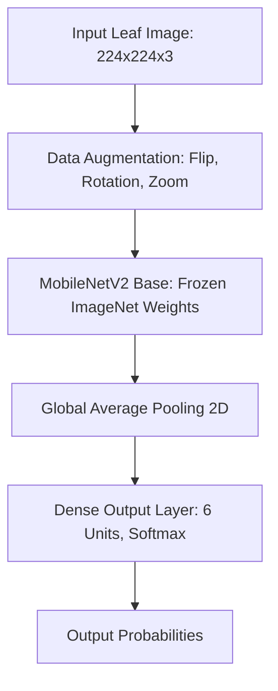

# AI Plant Disease Detection System

[](https://www.python.org/)
[](https://www.tensorflow.org/)
[](https://streamlit.io/)
[](https://opensource.org/licenses/MIT)

An end-to-end, production-ready computer vision application designed to diagnose crop leaf diseases from digital images. Utilizing transfer learning with a custom-tuned **MobileNetV2** architecture, the system classifies leaves from potato and tomato crops into six distinct categories. Upon classification, the application queries an offline SQLite-backed database and a JSON knowledge base to fetch disease symptoms, immediate treatment protocols, and long-term prevention guidelines, alongside rendering interactive confidence breakdowns and maintaining user query history.

---

## 1. Project Overview
Agricultural yield loss due to plant pathogens directly threatens food security and farming livelihoods. This system provides a deployable, scalable solution for immediate field diagnostics. By optimizing lightweight architectures (MobileNetV2) via transfer learning, the system can run low-latency inference on commodity hardware or cloud platforms. 

The application is structured around a decoupled model pipeline:
- **Core Engine**: A Python-based TensorFlow pipeline supporting image preprocessing, augmentation, and transfer learning training.
- **Inference CLI**: A modular command-line tool for standalone predictions.
- **Database Boundary**: A relational schema mapping query transactions, timestamps, crop types, and confidence scores for historical analytics.
- **Interactive UI**: A Streamlit web dashboard built with a professional, nature-inspired design system implementing custom theme elements.

---

## 2. Key Features
* **Multi-Crop Classification**: Accurately classifies six different crop health statuses across Potato and Tomato species.
* **Granular Confidence Interpretation**: Formulates confidence thresholds ("High", "Medium", "Low") to safeguard decision support.
* **Domain Knowledge Mapping**: Automatically fetches symptoms, treatment protocols, and prevention techniques upon prediction.
* **Tiered Probability Visualization**: Falls back gracefully from Plotly interactive charts to native Streamlit visualizations or Pandas tables based on system dependency availability.
* **Analytics Engine**: Captures prediction logs in an SQLite database and renders aggregate metrics (total queries, average confidence, latest crops) within a custom dashboard.
* **Robust Preprocessing Pipeline**: Employs auto-augment, scaling, learning rate decay, and class weighting to handle class imbalance.

---

## 3. Application Screenshots

### Diagnosis Tab & Prediction Summary
The primary interface allows users to upload a leaf image. Upon running the diagnosis, it displays the prediction status and a confidence progress bar inside styled, theme-integrated containers.


### Disease Information & Probability Breakdown
The application displays structured, three-column diagnostic cards detailing the Symptoms, Treatment, and Prevention steps. Below the details, an interactive horizontal probability breakdown shows class distributions.


### Analytics & Prediction History
The second tab exposes an administrative database view. It computes real-time overview metrics (Total Predictions, Average Confidence, Latest Prediction) and displays a paginated prediction history table with embedded confidence progress indicators.


---

## 4. Model Architecture
The system employs **MobileNetV2** as the base feature extractor, pretrained on the ImageNet corpus. This choice optimizes the balance between parameter efficiency (suitable for mobile/edge deployment) and representation capacity.



### Preprocessing & Optimization Parameters
* **Input Resolution**: $224 \times 224$ pixels (RGB).
* **Base Frozen Weight Initialization**: ImageNet.
* **Output Classification Head**: Global Average Pooling followed by a Softmax layer with 6 units.
* **Regularization & Callbacks**:
  * **Early Stopping**: Monitors validation loss (patience = 5, restores best weights).
  * **Model Checkpointing**: Saves model configuration and weights only when validation loss improves.
  * **Learning Rate Scheduler**: Decays the learning rate by a factor of 0.2 if validation loss plateaus for 3 epochs.
  * **Class Weight Balancing**: Automatically computes and applies weights to training batches based on class frequencies.

---

## 5. Dataset Information
The model is trained on subsets of the public **PlantVillage Dataset**, specifically targeting Solanaceae (potato and tomato) crops.

| Class Label | Crop Type | Pathological Status | Raw Image Count |
| :--- | :--- | :--- | :--- |
| `Potato___Early_blight` | Potato | Fungal infection (*Alternaria solani*) | 1,000 |
| `Potato___Late_blight` | Potato | Oomycete pathogen (*Phytophthora infestans*) | 1,000 |
| `Potato___healthy` | Potato | Healthy / Control Group | 152 |
| `Tomato___Early_blight` | Tomato | Fungal infection (*Alternaria solani*) | 1,000 |
| `Tomato___Late_blight` | Tomato | Oomycete pathogen (*Phytophthora infestans*) | 1,909 |
| `Tomato___healthy` | Tomato | Healthy / Control Group | 1,591 |

---

## 6. Model Performance
After training with early stopping, the final model achieved the following performance metrics evaluated on a holdout test split (15%):

### Global Classification Metrics
* **Accuracy**: `93.30%`
* **Weighted Precision**: `93.30%`
* **Weighted Recall**: `93.30%`
* **Weighted F1-Score**: `93.28%`

### Per-Class Evaluation Summary
| Class Name | Precision | Recall | F1-Score | Support |
| :--- | :---: | :---: | :---: | :---: |
| Potato Healthy | 1.00 | 0.96 | 0.98 | 23 |
| Potato Early Blight | 0.97 | 0.88 | 0.92 | 150 |
| Potato Late Blight | 0.86 | 0.97 | 0.91 | 150 |
| Tomato Healthy | 0.99 | 0.96 | 0.98 | 239 |
| Tomato Early Blight | 0.87 | 0.82 | 0.85 | 150 |
| Tomato Late Blight | 0.94 | 0.96 | 0.95 | 286 |

---

## 7. Tech Stack
* **Runtime**: `Python 3.9+`
* **Deep Learning Framework**: `TensorFlow 2.15+`, `Keras`
* **Web UI Framework**: `Streamlit 1.32+`
* **Visualization Libraries**: `Plotly 5.18+`, `Matplotlib 3.8+`
* **Data Manipulation**: `NumPy 1.26+`, `Pandas 2.2+`
* **Scientific Computing & Preprocessing**: `Scikit-Learn 1.4+`, `Pillow (PIL) 10.2+`
* **Persistence Boundary**: `SQLite 3` (built-in relational backend)

---

## 8. Project Structure
```text
PlantPlantDiseaseDetection/
├── dataset/                    # Dataset split configurations
│   ├── processed/              # Cleaned and resized RGB images
│   └── raw/                    # Source class folders from PlantVillage
├── docs/                       # Performance metrics and system evaluation assets
│   ├── images/                 # README screenshot resources
│   ├── classification_report.txt
│   ├── confusion_matrix.png
│   ├── training_accuracy.png
│   └── training_loss.png
├── knowledgebase/              # JSON repository containing symptoms & treatments
│   └── disease_info.json
├── logs/                       # Application, training, and prediction history logs
├── models/                     # Saved Keras model configurations & labels
│   └── saved_models/
│       ├── best_model.keras
│       └── labels.json
├── src/                        # Core application source modules
│   ├── __init__.py
│   ├── config_loader.py        # Shared configurations mapper
│   ├── data_preprocessing.py   # Dataset splitting and parsing utility
│   ├── database_manager.py     # SQLite schema definitions and execution bindings
│   ├── knowledge_base.py       # JSON mapping layer for symptoms & treatments
│   └── predictor.py            # Preprocessing and model classification execution wrapper
├── tests/                      # Automated test suite (Pytest integration)
├── app.py                      # Interactive Streamlit application portal
├── config.py                   # Central directory configurations file
├── database.py                 # SQLite helper entry point
├── predict.py                  # Standalone CLI prediction portal
├── requirements.txt            # Package manifest with version controls
└── train.py                    # Transfer learning train execution entry point
```

---

## 9. Installation Guide

### Prerequisites
Ensure that you have Python 3.9 or higher installed on your system.

### 1. Clone the Repository
```bash
git clone https://github.com/yourusername/PlantPlantDiseaseDetection.git
cd PlantPlantDiseaseDetection
```

### 2. Set Up a Virtual Environment (Windows)
```powershell
# Create environment
python -m venv venv

# Activate environment
venv\Scripts\activate
```

### 3. Install Dependencies
```powershell
python -m pip install --upgrade pip
pip install -r requirements.txt
```

---

## 10. Training the Model
To split the raw dataset, apply image augmentation, calculate class weights, and train the MobileNetV2 network:

1. Place the raw class directories under `dataset/raw/PlantVillage/`.
2. Generate the splits:
   ```bash
   python src/data_preprocessing.py
   ```
3. Run the training script:
   ```bash
   python train.py
   ```
The best model will be saved as `models/saved_models/best_model.keras` and training loss/accuracy curves will be output to the `docs/` directory.

---

## 11. Running Predictions (CLI)
You can run standalone predictions directly from the command line using `predict.py`. Pass the path to any leaf image:

```bash
python predict.py path/to/leaf-image.jpg
```

---

## 12. Running the Streamlit Application
Start the interactive dashboard interface locally:

```bash
streamlit run app.py
```
Open the browser URL provided in the console (typically `http://localhost:8501`).

---

## 13. Example Prediction Output (CLI)
When running `predict.py`, the console outputs a structured diagnostic summary:

```text
==================================================
AI PLANT DISEASE DETECTION SYSTEM - DIAGNOSIS
==================================================
Image Path: dataset/raw/PlantVillage/Tomato___Late_blight/0003_late_blight.jpg
Predicted Class: Tomato Late Blight
Confidence Score: 99.90%
Interpretation: High Confidence - The model is highly certain of this diagnosis.

--- Disease Information ---
Symptoms:
• Leaves develop rapidly expanding, water-soaked dark lesions.
• White fungal growth may appear on leaf undersides in humid weather.

Treatment:
• Remove infected plants promptly to reduce spread.
• Consult local guidance for an approved late-blight fungicide program.

Prevention:
• Use resistant varieties and certified disease-free plants.
• Avoid overhead irrigation and monitor during cool, wet conditions.
==================================================
* Results saved to SQLite database.
```

---

## 14. Evaluation Metrics
The system evaluated model training convergence and class confusion to ensure minimal generalization loss:

* **Training History**: Curves output to `docs/training_loss.png` and `docs/training_accuracy.png` show no significant divergence, confirming training stability.
* **Confusion Matrix**: Output to `docs/confusion_matrix.png` evaluates the cross-classification rates between classes. The lowest precision occurred between early blight classes, which is expected due to visual similarities in early-stage foliar spots.

---

## 15. Future Improvements
* **Layer Fine-Tuning**: Unfreeze the top layers of the MobileNetV2 base to fine-tune weights on leaf textures after initial convergence.
* **Edge Optimization**: Convert the native Keras model into TensorFlow Lite (`.tflite`) format for on-device, offline mobile inference.
* **Class Expansion**: Include additional Solanaceae family members (e.g., eggplants, bell peppers) and non-fungal pathogens (viruses/bacteria).
* **Multi-Modal Integration**: Support geographical region filtering to calibrate prediction priors based on local humidity and temperature.

---

## 16. Learning Outcomes
* **Computer Vision & Transfer Learning**: Implemented transfer learning on specialized convolutional neural networks, managing feature freezing, pooling, and custom heads.
* **Production Code Architecture**: Architected decoupled codebase modules separating UI (`app.py`), DB bindings (`database_manager.py`), preprocessing (`data_preprocessing.py`), and configs (`config.py`).
* **Session State Management**: Managed Streamlit session state properties to store prediction cache objects, avoiding resource-expensive model recalculations during UI interactions.
* **Robust Visualization Fallbacks**: Built a dependency-aware rendering pattern enabling graceful degradation of graphical plots.

---

## 17. Author
* **Developer**: [Srikesh](https://github.com/srikesh-10)
* **GitHub Portfolio**: [@srikesh-10](https://github.com/srikesh-10)
* **Contact / Profile**: Computer Science / Machine Learning Portfolio

---

## 18. License
This project is licensed under the MIT License - see the [LICENSE](LICENSE) file for details.
